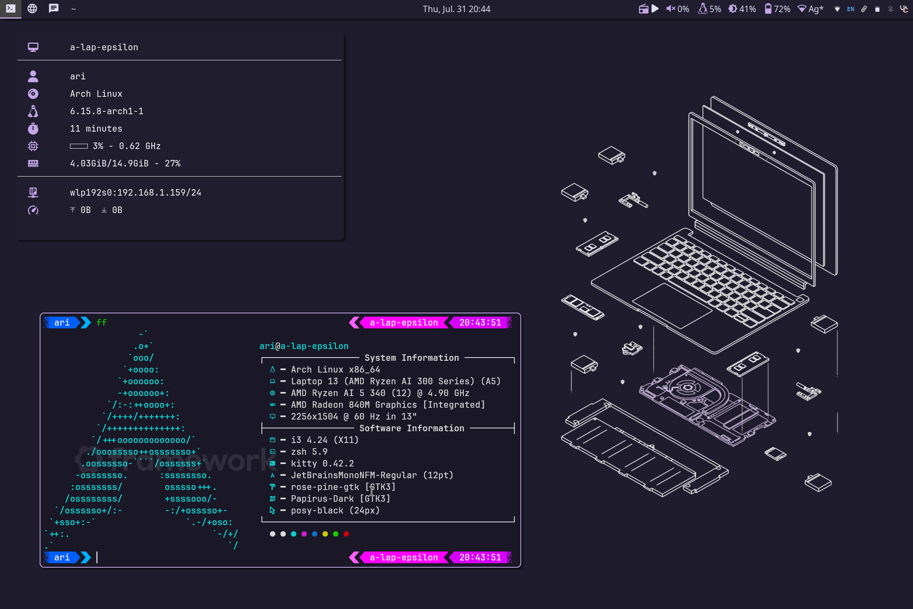

# dotfiles

My dotfiles, for use on Linux.  

This repository also includes some simple scripts and other small projects that don't deserve their own repos.  

Much of what is here is very janky. If you use something, consider copying only the parts you actually need. 

## Screenshots




## Installation (Stow)

There is an install script ([`/install.sh`](./install.sh)) in this repository. It can be piped into bash for easy installation, as it will clone the rest of the repo to the directory of your choice itself. The script is also fairly simple if you wish to just copy the necessary commands manually for security reasons. 

```
curl 'https://ari43.net/dotfiles/install.sh' | bash
```

You will need to remove conflicting files and/or symlinks before running the installer. The installer also needs to be run again when new files are added to the repository. 

## Dependencies

Dependencies follow Arch and AUR package names, since that's what I currently use most of the time. These are for i3 and do not include all experimental configs in this repo (ie. Hyprland). 

### Important

`i3 rofi picom polybar xbindkeys kitty bash`  

### Optional

`xfce4-power-manager libnotify xfce4-notifyd kvantum kvantum-qt5 kvantum-qt4-git papirus-icon-theme papirus-folders graphite-kde-theme-git graphite-gtk-theme-nord-git xfce4-clipman-plugin redshift redshift-gtk blueman streamdeckui xorg-setxkbmap xorg-xrdb clight clight-gui-git kdeconnect polkit-gnome gtk3-nocsd-git light-locker xfce4-screensaver i3lock firefox feh glib2 libinput-gestures xkb-switch conky zsh zsh-syntax-highlighting zsh-autosuggestions neovim xborder-git ttf-jetbrains-mono zenity`

## Structure

The files within this repository are meant to be placed inside the user's home folder. For example, the `.config` folder in this repository should be placed at `$HOME/.config`. Files that are to be placed relative to root (`/`) are located in the `/rootfs` folder of this repository. 

There is also a `stable` branch that is slightly older but doesn't include as many experimental changes. 

## Issues and To-Do

There are still issues with these dotfiles. They are outlined in [TODO.md](./TODO.md). 

## Important Note: Keyboard Layout

I'm a user of the Dvorak keyboard layout, so keybinds are optimized for that. Wherever possible I have used key codes instead of symbols (letters) for binds, but in some cases this is not possible, such as with neovim. Most cases of this are small and can be edited out easily. 
